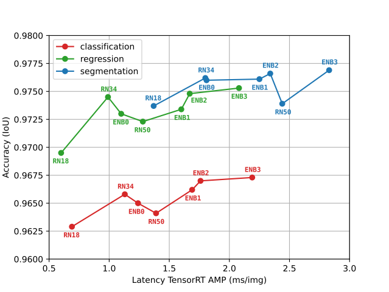
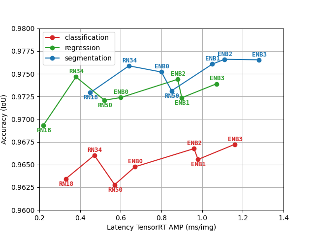

# TEP-Net-V2
Experiments with [TEP-Net (Laurent 2024)](https://arxiv.org/abs/2403.13094), with the goal of improving performance through architectural enhancements.

A large part of the code in this work comes from the repository that is associated with the publication, [train-ego-path-detection](https://github.com/irtrailenium/train-ego-path-detection), as this work is a continuation of that work. Please star [train-ego-path-detection](https://github.com/irtrailenium/train-ego-path-detection), and cite the original paper from Thomas Laurent, if you find his work useful:

```bibtex
@misc{laurent2024train,
      title={Train Ego-Path Detection on Railway Tracks Using End-to-End Deep Learning}, 
      author={Thomas Laurent},
      year={2024},
      eprint={2403.13094},
      archivePrefix={arXiv},
      primaryClass={cs.CV}
}
```
The changes I made to his code are my own, and are not associated with the authors or publishers of the original work.

# Results Reproduction
On the left: a reproduction of figure 8 from Laurent 2024. Results obtained on an NVIDIA Quadro RTX 6000 GPU, with PyTorch v2.2.1 and TensorRT v8.6.1 (CUDA v12.1). Reproduced to simplify comparison. Please refer to and cite the original paper when appropriate. On the right: Results of rerunning the training and evaluation. Results obtained on an NVIDIA RTX 4090 GPU with PyTorch 2.5.0 and TensorRT v10.7.0 (CUDA 12.4).
<p align="center">
  
  
</p>

The major difference between the results in figure 8 of Laurent 2024 and the reproduced results is the latency of the different models. This is to be expected, since the 
results were reproduced on different hardware. Notable here is the fact that the order of the models in terms of latency is not preserved.

# Prediction Confidence
In many situations, having an indication of the model's confidence is useful. To facilitate this, I created some extensions to the classification and regression models.

## Classification
The classification model discretizes the y-axis into anchors and the x-axis into bins, and then outputs two discrete probability distributions over the bins for each anchor, on for the left and one for the right rail. The probability assigned to the bins by the model correspond to the probability that the rail is located in the bin. The model then outputs the argmax over the distribution as the final prediction. We can use the [entropy](https://en.wikipedia.org/wiki/Entropy_(information_theory)) of the distribution to construct a proxy for confidence. We output a confidence score $C_h$ for each anchor $h$, defined as 1 minus the normalized entropy:
$$C_h = 1 - \frac{\sum_{i=1}^{W+1}p_i\log(p_i)}{\log(W+1)}$$
Where $W + 1$ is the number of horizontal bins, plus one bin corresponding to no rail, and $p_i$ is the probability the model assigns to that bin. We average the confidence of the two rails for each anchor.

The video below demonstrates this confidence. On the left, the unaltered classification model output. On the right, this same output, but with the detection color corresponding to the confidence. Pure green corresponds to a confidence of 1, pure red to a confidence of 0, and intermediate values falling in between on the color gradient.

